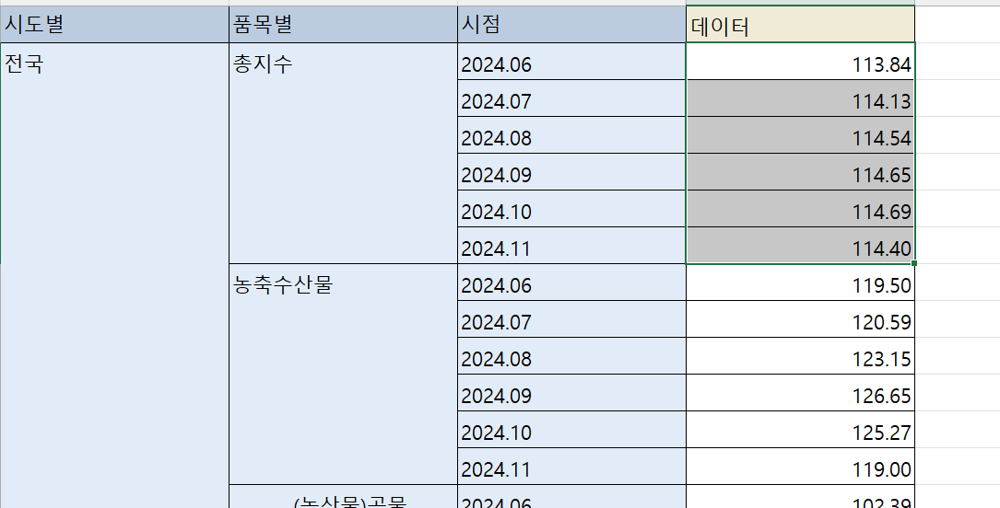
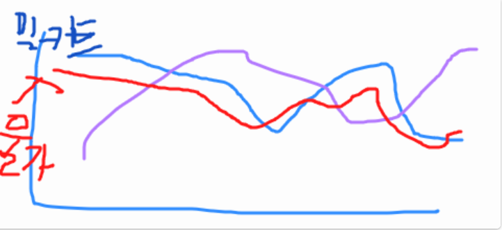

<!-- 또는 HTML로 크기 조절 -->

에서 Readme 실시간 정리 중입니다. 

---

# 0. 페르소나 설정

**밀키트 스타트업**

- 특징 : 전자상거래를 통해 밀키트를 판매함.

- 오프라인 유통을 고려하고 있음.

- **B2C** 시장 분석이 필수적으로 요구되며 과경쟁 상황에 있음.

- 세분화 :
  어떤 밀키트 종류를 파는 회사인지 정하기

### 보고서 작성 방향

신사업 계획서 

타겟 같은 경우는 데이터 분석을 하는 과정에서 설정하기

with 시장분석(TAM, SAM, SOM 분석)
=> 1인가족, 젊은 부부, 캠핑, 야행, 홈파티(손님초대)
Seasonal : 여름,가을 -> 캠핑 관련된 것 / 봄 -> fresh한 느낌의 밀키트
fresh한 밀키트의 경우의 유통 방식은?

타겟을 정한 후 전략 수립 (STP 분석)
who 누구를 타겟으로
what
when
where 어느 위치?
why
how (STP분석)

# 1. 시장분석

### 시장분석

1. 전체적인 밀키트 시장의 추이 (년도별 밀키트 시장 규모) -> 추가분석: 관계분석
2. 오프라인 밀키트 시장의 트렌드 → 어디서 데이터를 
3. 전체 밀키트 시장 중 업계 top N순위에 속하는 업체는? → 해당 업체의 재무제표 등 분석 -> 어떤 부분에서 이익을 내고 있는지?
4. 전체 밀키트 시장 중 어떤 어떤 카테고리가 매출이 높은지 -> 레드오션 but 도출은 새로운 시장보다는 간단한 편
5. 아직 나오지 않은 밀키트 지만 수요가 있어 보이는지 ( 잠재시장 )
6. 밀키트 시장이 줄어드는 원인
-> (고객설문데이터 등을 통해 파악) ex. 쓰레기가 많이 나와서
-> 부정적인 리뷰를 수집할 수 있는지?

### <데이터 수집 사이트 목록>

- [문화 빅데이터 - 포털- 전체 상품](https://www.bigdata-culture.kr/bigdata/user/data_market/list.do?dataCookieYn=N)
- [데이터 현황 - 통합 데이터지도](https://www.bigdata-map.kr/dashboard)
- [KADX 농식품 빅데이터 거래소](https://kadx.co.kr/)
- [KOSIS 국가통계포털](https://kosis.kr/index/index.do)
- [WooilJeong/PublicDataReader: 공공 데이터 조회를 위한 오픈소스 파이썬 라이브러리](https://github.com/WooilJeong/PublicDataReader)

### 데이터 수집

(1) 밀키트 매출 데이터
-> 카테고리, 연령, 채널(온 or 오프라인), 지역(인구통계데이터와 관련하여 100의 20대인구가 사는데 구매량은 1달에 10) 등

(담당자미정)https://www.bigdata-map.kr/search/theme?searchKey=%EB%B0%80%ED%82%A4%ED%8A%B8&typeFilters=

전체적으로 어느 식품 카테고리의 소비가 많은지? 

데이터 : (은정님) https://kadx.co.kr/opmk/frn/pmumkproductDetail/PMU_5fe8f2b8-47aa-43a6-8daf-ab9c2e9b84c2/5#

   (?) 신상품 출시 -> 트렌드 

(지혜님) 인구통계 데이터 : 타겟 고객의 분포 확인 : https://kosis.kr/statisticsList/statisticsListIndex.do?vwcd=MT_ZTITLE&menuId=M_01_01&outLink=Y&entrType=#content-group

(우상님) 외식현황 데이터 : KOSIS → 외식이 많을 수록 밀키트 구매량이 줄어든다. 

(2) 특정상품(ex.제육볶음)에 대한 검색량 추이 ⇒ 상품 타겟 정할 때 사용  

(우상님) 이미 존재하는 서비스 사용 - 판다랭크 : https://pandarank.net/search/detail

월별로 어떤 상품 주력? → 계절성을 띄는 상품들

(3) 농산물 가격 변동 → 잘 활용하고 싶음  / 분석방법론(조언)

환율, 주요 식재료의 가격 데이터, 소비자 물가지수 ( 품목별로 물가지수 존재)

그래프 형태로 

전체 밀키트 말고 주력으로 밀고갈 상품 몇 개에 대해서만 

ex) 제육볶음밀키트 

돼지고기, 양파 등의 가격 지수 / 제육볶음 밀키트 

가격 (ex. 알배추가 가장 저렴한 시즌에 밀푀유 나베를 판매 및 프로모션)  

https://kosis.kr/statisticsList/statisticsListIndex.do?vwcd=MT_ZTITLE&menuId=M_01_01&outLink=Y&entrType=#content-group

전제: 농산물 가격이 높아지게 되어도 밀키트의 가격은 유지됨 ( 기간은 예를 들어 1달)

 ex. 농산물의 가격이 높아지게 되면 밀키트의 수요가 늘어난다. (영가설 ) 

가격변동이 심한 농산물 : ex 대파, 배추, 과일, 야채(명절시점에 수요 증가) 

주요 판매 밀키트를 시기별로 조정 → 가격 데이터를 기반으로 해서 시즌별로 밀키트 기획 

밀키트 필수 식재료들의 월별 물가 조사

호주산 소고기 등 수입 식재료들의 물가 + 환율(영향) 

사례 ) 

옥수수 수입 (사료) → 환율을 많이 고려 / 어느 지역에서 얼만큼 사용하는 것이 적절한지 / 구매단가 

### 관계분석

전체적인 밀키트 시장 추이와 관련해서 거시적으로 어떤 요인이 영향을 주는지 상관간계 분석 (시즌성이 있는지 등)

- 1인 가구가 늘어났을 때 밀키트 수요도 늘어 난다. (상관에 대한 유의성이 있다. ) 
ex)

### 재우님 Feedback

- 검증할 것들을 추려보기

시장규모 ← 1. 기업 매출이 전체적으로 공개되어야 함 (국세청만 알고있음) 

1. 추상하기 : 판매량 생각 *객단가 = 매출 
2. 통계청에서는 1조, but 추산해보니까 100억 → ex. 오프라인 채널은 30%만 차지
3. 추상하기로는 모집단 추산 정도 / 부재한 데이터기 때문에 drop하기 보다는 어떻게 돌아갈 수 있을지 생각 

경쟁사 ←  

5주차 프로젝트1 에서는 1,2주제로만 등으로 추리기 

주차별로 결과물 취합해서 정리 

가설 수립을 위한 아이디어 리스트:

- 오프라인 유통에 대한 방식 아이디어 :
배송 대행 업체
이마트 - 대형매장 지역으로 배송
아파트, 오피스텔 밀집된 지역 - 무인 매장
ex. 바다냉장고

중앙 - 개인사업자 (지역 아파트, 동 을 커버해서 배송) ex. 야구르트

밀키트의 오프라인 유통방식은 어떻게 해야 유리할까 ?

1. 유통 기한을 길게 : 상품마다 유통기한이 다르다.
2. 고객 타겟 : 어느지역에 매장을 ?

# 2. 경쟁사 데이터 분석

# 3. 트래픽 기반/소셜 데이터 분석

# 4. 사용자 행동 분석

(? ) -> 이 데이터를 어디서 구할 수 있는지

# 5. 데이터 시각화  + 보고서 작성의 순서
