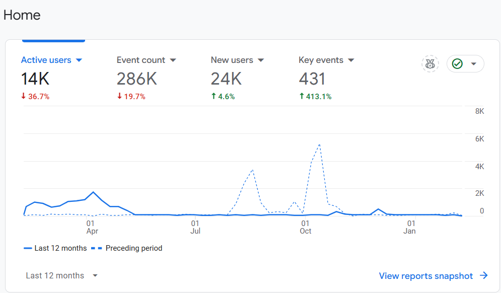

# GA4_데이터너겟_탐색리포트_코호트

최근 12개월 Active users 를 보면, 23년 10월이 가장 높았던 것으로 확인됨.
이에 따라서 최근 1개월 (25년 1월)과, 23년 10월 두 기간을 비교해보고자 함.

하지만, 현재 23년 10월은 오래된 데이터로 GA에서 접근 불가.
대안으로 24년 4월을 비교대상으로 삼고자 함.

---

# 1. 탐색 리포트

**기간 비교:**

- **2024년 4월 1일 ~ 4월 30일** vs **2025년 1월 1일 ~ 1월 31일**
- 전체 **활성 사용자(Active Users)가 93.3% 감소**

---

## **📌 주요 분석 포인트**

1️⃣ **유입 경로별 활성 사용자 수 변화**

2️⃣ **구글 CPC(광고) 성과 급감**

3️⃣ **Direct 트래픽(직접 유입) 감소**

4️⃣ **Organic 트래픽(검색엔진) 유지율 저하**

5️⃣ **Referral(추천 트래픽) 소멸**

---

## **1️⃣ 유입 경로별 활성 사용자 수 변화**

| 유입 경로 | 2024년 4월 | 2025년 1월 | % 변화 |
| --- | --- | --- | --- |
| **google / cpc (유료 광고)** | 4,174 | 3 | **-99.9%** 🔻 |
| **direct / (none) (직접 방문)** | 435 | 102 | **-76.6%** 🔻 |
| **(not set) (미확인 트래픽)** | 46 | 91 | **+97.8%** 🔺 |
| **google / organic (검색 유입)** | 96 | 35 | **-63.5%** 🔻 |
| **googleads.g.doubleclick.net / referral (추천 트래픽)** | 60 | 0 | **-100%** 🔻 |
| **총 활성 사용자** | 4,787 | 319 | **-93.3%** 🔻 |

---

## **2️⃣ 구글 CPC(광고) 성과 급감 (-99.9%)**

**4,174 → 3으로 급락**

- 2024년 4월에는 **구글 광고(Google CPC)** 트래픽이 전체 트래픽의 **87.2%**(4,174/4,787) 차지
- 2025년 1월에는 **구글 광고 트래픽이 거의 사라짐**

💡 **시사점:**

✔️ 구글 광고 캠페인이 중단되었거나, 예산 소진 또는 광고 집행 방식 변경

✔️ CPC 광고 성과 분석 필요 (클릭률, 전환율 감소 여부 확인)

✔️ 광고 성과가 좋았다면, 다시 집행 여부 검토

---

## **3️⃣ Direct 트래픽 (직접 방문) 감소 (-76.6%)**

**435 → 102로 급감**

- 브랜드 인지도가 높은 경우, Direct 트래픽이 안정적이어야 함
- Direct 트래픽은 보통 **기존 고객/충성 고객, 이메일/북마크 방문, 직접 URL 입력**을 의미

💡 **시사점:**

✔️ 기존 고객 유지 전략 필요 (이메일 마케팅, 리타겟팅 광고, 프로모션 활용)

✔️ 충성 고객 유입이 줄어들었다면 **브랜드 인지도 저하 가능성**

---

## **4️⃣ Organic 트래픽 (검색 유입) 감소 (-63.5%)**

**96 → 35로 감소**

- SEO(검색 엔진 최적화) 영향
- 구글 검색 랭킹 변화 또는 경쟁사의 SEO 전략 강화 가능성

💡 **시사점:**

✔️ SEO 성과 점검 → **어떤 키워드에서 트래픽이 감소했는지** 확인

✔️ 검색 랭킹이 떨어졌다면, **콘텐츠 최적화 & 백링크 확보 전략 필요**

✔️ 구글 검색 콘솔(Google Search Console)에서 **검색 노출 감소 여부 분석**

---

## **5️⃣ Referral(추천 트래픽) 소멸 (-100%)**

**60 → 0으로 사라짐**

- 구글 광고 네트워크(Google Ads, DoubleClick)에서 유입된 트래픽이 완전히 사라짐
- 광고 캠페인 종료 가능성

💡 **시사점:**

✔️ 구글 디스플레이 광고(GDN) 집행 여부 확인

✔️ 다른 추천 트래픽 채널(제휴 사이트, 블로그, SNS 등) 확대 필요

---

## 🔹 **비즈니스 결론 & 개선 방안**

### **✅ 1. 광고 집행 여부 재검토**

- CPC 트래픽이 가장 큰 비중을 차지했으므로, **광고가 성과를 내고 있었다면 다시 집행 필요**
- 광고를 계속 집행하지 않는다면, **SEO 및 브랜드 인지도 강화를 통한 유입 경로 다변화 필요**

### **✅ 2. Direct 트래픽 회복 전략**

- 기존 고객 리텐션 전략 강화 (이메일 마케팅, 리마케팅 광고, 프로모션 진행)
- 브랜드 검색 및 다이렉트 유입 증가를 위한 **SNS 홍보, 브랜드 캠페인 진행**

### **✅ 3. SEO 전략 강화**

- 구글 검색 콘솔(GSC)에서 **검색어 순위 분석 후, SEO 최적화**
- 경쟁사 대비 검색 유입 전략 점검 (콘텐츠 개선, 블로그 및 백링크 활용)

### **✅ 4. 추천 트래픽(Referral) 복구**

- 과거에 유입이 많았던 **제휴 사이트 & 광고 네트워크 분석**
- SNS, 블로그, 제휴 마케팅을 활용해 추천 트래픽을 회복

---

# 2. Cohort 분석

## **📌 분석 개요**

- **2025년 1월 코호트 분석** (첫 번째 이미지)
→ 신규 유입 205명, 유지율 극히 낮음
- **2024년 4월 코호트 분석** (두 번째 이미지)
→ 신규 유입 4,667명, 상대적으로 높은 유지율

---

## **1️⃣ 코호트별 주요 지표 비교**

| 기간 | 신규 사용자 (Week 0) | Week 1 유지 | Week 2 유지 | Week 3 유지 | Week 4 유지 |
| --- | --- | --- | --- | --- | --- |
| **2025년 1월** | 205 | 4 (1.9%) | 2 (0.9%) | 0 (0%) | 1 (0.5%) |
| **2024년 4월** | 4,667 | 56 (1.2%) | 15 (0.3%) | 11 (0.2%) | 8 (0.2%) |

---

## **2️⃣ 주요 발견점**

### **✅ 1. 전체 유입 규모 급감**

- 2024년 4월: **4,667명** 신규 유입
- 2025년 1월: **205명** 신규 유입 → **95.6% 감소**

💡 **시사점:**

✔️ **마케팅 예산이 크게 줄었거나, 광고 채널이 중단되었을 가능성**

✔️ **SEO(검색 엔진 최적화) 및 브랜드 인지도 하락**

---

### **✅ 2. 유지율(Retention Rate) 저조 (특히 1월)**

- 2024년 4월: **Week 1 유지율 1.2%, Week 4 유지율 0.2%**
- 2025년 1월: **Week 1 유지율 1.9%, Week 4 유지율 0.5%**
- 2025년 1월의 유지율이 다소 높지만, **전체 트래픽 자체가 낮아 의미 있는 성과라고 보기 어려움.**

💡 **시사점:**

✔️ 유지율이 낮은 이유 분석 필요 → UX/UI 개선, 이메일 마케팅 활용

✔️ 리텐션 마케팅(푸시 알림, 프로모션, 콘텐츠 재방문 유도) 필요

---

### **✅ 3. 2025년 1월 사용자 이탈 심각**

- **Week 3 유지율(0%)** → **3주 후 재방문하는 유저가 없음**
- 2024년 4월의 경우 **3주 차에도 일부 사용자가 남아 있음**

💡 **시사점:**

✔️ **콘텐츠/서비스의 초기 이탈률이 매우 높아 재방문 유도 실패**

✔️ **사용자 경험(UX) 및 첫 방문 후 지속적인 인터랙션(이메일, 푸시 알림 등) 필요**

---

### **✅ 4. 신규 방문자의 행동 패턴 변화**

- 2024년 4월에는 신규 유입 규모가 크고, 일정 부분 잔존
- 2025년 1월에는 **소규모 유입 + 즉각적인 이탈**

💡 **시사점:**

✔️ **트래픽 품질 저하 가능성** → 새로운 유입이 광고/SEO로 유입된 적절한 타겟인지 확인

✔️ **페이지 내 정보 부족** → 고객이 더 많은 정보를 얻고 재방문할 수 있도록 콘텐츠 강화

---

## **📌 결론 및 개선 방안**

### **🔹 1. 유입 트래픽 증가 필요**

- 광고 집행 재검토: CPC(Google Ads) 중단 여부 확인 후 재집행 고려
- SEO 전략 강화: 검색 유입(Organic) 최적화
- SNS 및 커뮤니티 활용: 브랜드 인지도 상승을 위해 유입 경로 다변화

### **🔹 2. 초기 사용자 이탈률 줄이기**

- 온보딩 프로세스 개선: 첫 방문 시 **즉각적인 가치 제공**
- 첫 방문 후 이메일/푸시 알림으로 재방문 유도

### **🔹 3. 유지율 개선을 위한 리텐션 전략 필요**

- 재방문 유도 콘텐츠 제작: **블로그, 이메일 뉴스레터, 프로모션 활용**
- 기존 사용자 리마케팅 진행: 페이스북, 구글 리마케팅 광고 활용

---